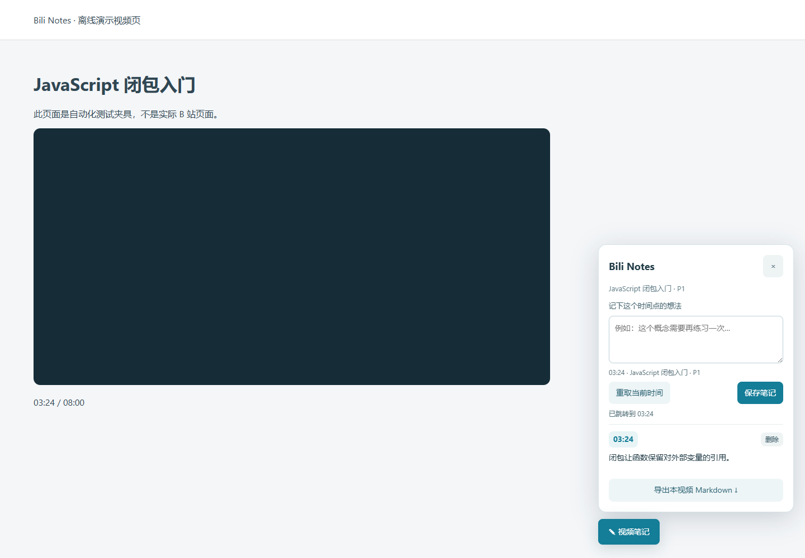

# Bili Notes

[](https://github.com/AK1116q/bili-notes/actions/workflows/ci.yml)

**边看视频边记笔记，把想法留在准确的时间点。**

A local-first browser extension for timestamped Bilibili video notes. No platform API credentials, no cloud account, no runtime dependencies.



> 演示截图使用离线测试页面，不是 B 站实际页面。

## 功能

- 视频页右下角打开笔记面板，记录当前播放时间和笔记内容。
- 点击笔记时间点回看；保留播放器原来的播放/暂停状态。
- 按视频与分 P 分别保存，支持页面内切换分 P。
- 笔记库支持搜索、编辑、删除，以及带时间链接的 Markdown 导出。
- JSON 全量备份与恢复；相同 ID 优先保留更新时间较新的版本。
- 数据只存放于当前浏览器的 `chrome.storage.local`。

## 安装

1. 下载或克隆本仓库，解压到一个长期保留的目录。
2. Chrome 打开 `chrome://extensions`；Edge 打开 `edge://extensions`。
3. 打开 **开发者模式**，选择 **加载已解压的扩展程序**。
4. 选择包含 `manifest.json` 的 `bili-notes` 目录。
5. 刷新已打开的 B 站普通视频页面，点击右下角 **视频笔记**。

安装不需要 Node.js。此版本未上架扩展商店。

## 使用

- `Alt + Shift + N`：打开面板，并聚焦输入框。部分系统可能占用该组合键，可直接点击按钮。
- 打开面板时取得当前时间；点击 **重取当前时间** 更新记录位置。
- `Ctrl + Enter` / `Command + Enter`：在输入框中保存笔记。
- 点击扩展工具栏图标：打开笔记库。通过扩展详情中的选项页可使用完整页面。
- **导出筛选结果 Markdown** 只导出当前搜索匹配项；**备份全部 JSON** 保存全部笔记。

切换分 P 时，已经输入的草稿保留原视频和时间点；面板会给出提示。备注输入上方显示记录所关联的视频，保存前可以重新取时间。

## 权限与隐私

只申请 `storage` 权限，并仅在 `https://www.bilibili.com/video/*` 注入内容脚本。通过页面现有的 HTML 视频元素读取时间，不使用 B 站 Cookie、登录令牌、私有接口或额外网络请求。

笔记包括视频 ID、分 P、时间、标题、正文和创建/修改时间。本地存储并非加密保险箱。卸载扩展会清除数据；请先导出 JSON 备份。恢复功能最多接受 10 MB / 5,000 条笔记。

## 支持范围与限制

- 第一版面向 Chrome/Edge Manifest V3 桌面浏览器；自动化集成测试使用 Edge。
- 支持普通 `/video/BV…` 和 `/video/av…` 页面；不支持直播、番剧 `/bangumi/`、手机 App 或跨站 iframe 播放器。
- BV 和 av 两种地址按不同标识保存，不调用 API 合并别名。
- 分 P 按 URL 中的 `p` 参数区分；依赖网站继续提供这些页面结构。
- 导出的时间链接包含 `p` 和 `t`；目标站点是否采纳跳转参数取决于其当前实现。当前页内点击时间直接设置播放器位置。
- 无跨设备同步。时间取整到秒，每条笔记最多 10,000 字符。
- 并发修改同一笔记采用最后写入生效；不同笔记按独立存储键保存。
- 网站播放器结构变化可能需要调整选择器；尚未完成登录后的真实 B 站页面人工验收。

## 开发

Node.js 22+，无需安装依赖：

```bash
npm test
```

修改后在浏览器扩展管理页点击重新加载，并刷新视频页。

结构：`core.js` 负责校验、视频标识和 Markdown；`background.js` 串行处理存储消息；`content.js` 提供隔离样式的页面面板；`library.*` 是笔记库。

实现参考 Chrome 官方 [内容脚本文档](https://developer.chrome.com/docs/extensions/develop/concepts/content-scripts) 与 [Storage API](https://developer.chrome.com/docs/extensions/reference/api/storage)。

查看 [验证记录](docs/VALIDATION.md) 与 [贡献说明](CONTRIBUTING.md)。

## 后续方向

- 给笔记添加标签，按课程组织。
- 提供可选择的快捷键配置。
- 为更多视频页面增加独立适配器。

## License

[MIT](LICENSE)
